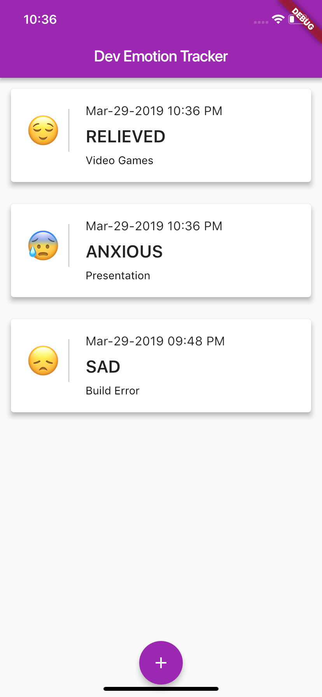
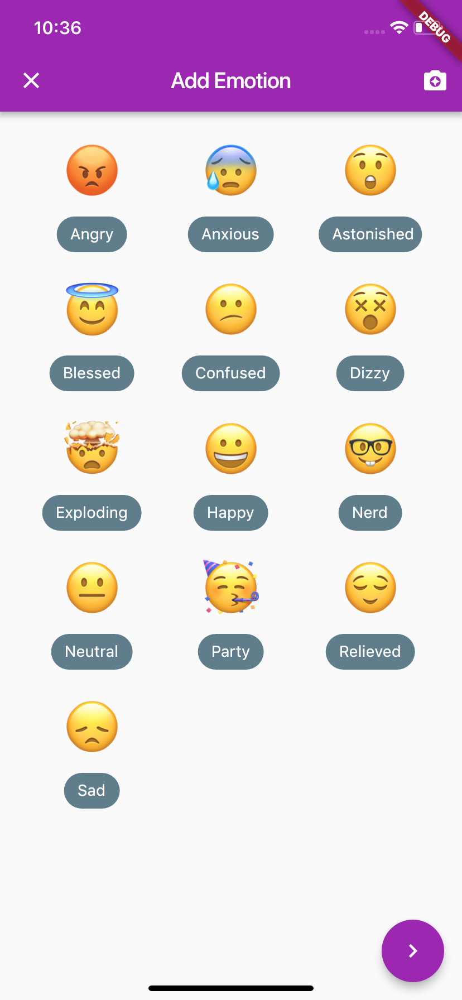
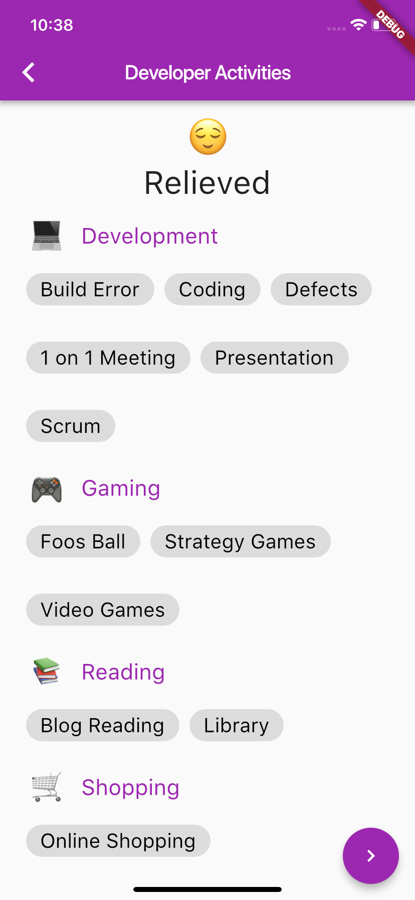

# Developer Emotion Tracker

Developer Emotion Tracker - Application built with flutter, firebase & fastlane. This application helps to track the emotion in developer's activities. 

Slides are here: https://slides.com/sivamuthukumar/flutter-firebase-fastlane

## Getting Started

To get started with Flutter, view Flutter's [online documentation](https://flutter.io/docs), which offers tutorials, samples, guidance on mobile development, and a full API reference.

## Screens

1. Main Screen - List the developer emotion, activity that triggers the emotion and date the emotion is captured

</img>

2. Add Emotion - User can select the emotion or take picture to detect the emotion from their face.

</img>

3. Add Activity - Select activity that triggers the emotion

</img>

